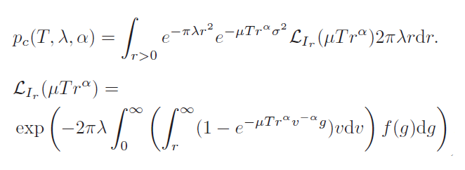

# A-Tractable-Approach-to-Coverage-and-Rate-in-Cellular-Networks
Use python to simulate the coverage probability of mathematical expressions  
*Coverage Rate:  
  
* Code: [coverage_rate.py](https://github.com/ciat31318/A-Tractable-Approach-to-Coverage-and-Rate-in-Cellular-Networks/blob/master/coverage_rate.py)
*Result:  

*The paper original figure(green line):

__Reference__
***
J. G. Andrews, F. Baccelli and R. K. Ganti, "A Tractable Approach to Coverage and Rate in Cellular Networks," in IEEE Transactions on Communications, vol. 59, no. 11, pp. 3122-3134, November 2011.
